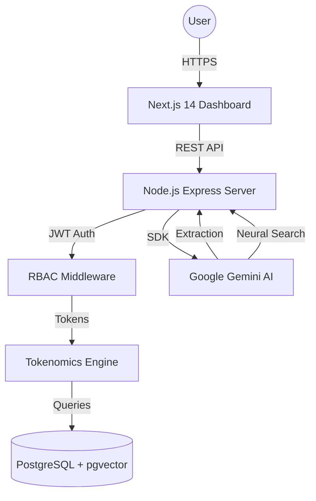

# RecruitIntel Architecture

## System Overview
RecruitIntel is built as a high-performance monorepo utilizing a modern AI-native stack.

## Core Components

### 1. Tokenomics Engine
Every high-value AI action (Job Posting, Neural Matching) is gated by a tokenomics middleware. It verifies user balance in the DB before allowing the service layer to proceed.

### 2. Neural Search Layer
Utilizes `pgvector` for initial semantic distance filtering followed by Gemini LLM for "Neural Reranking" and qualitative reasoning.

### 3. Design System
Strict technical aesthetic using Tailwind CSS constants and "glassmorphism" components.
